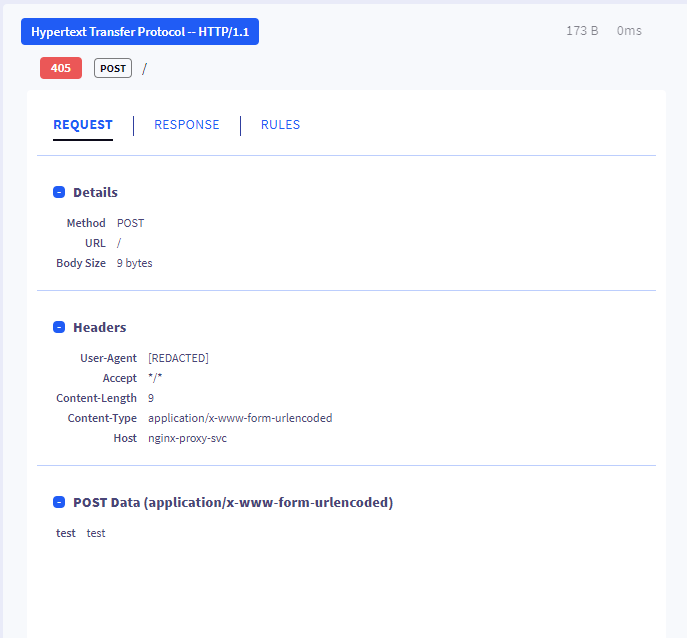
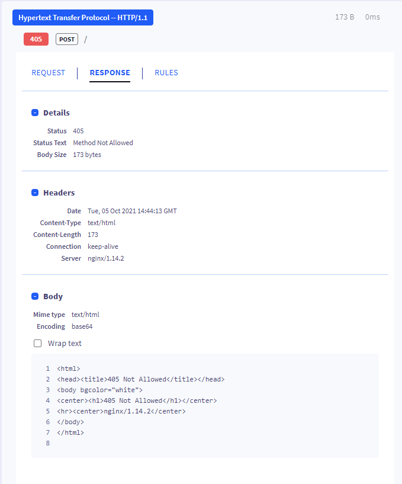
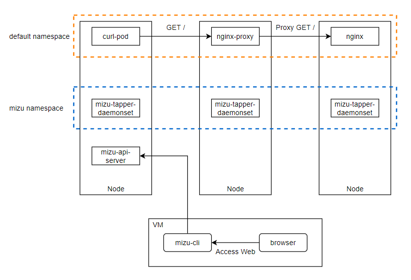
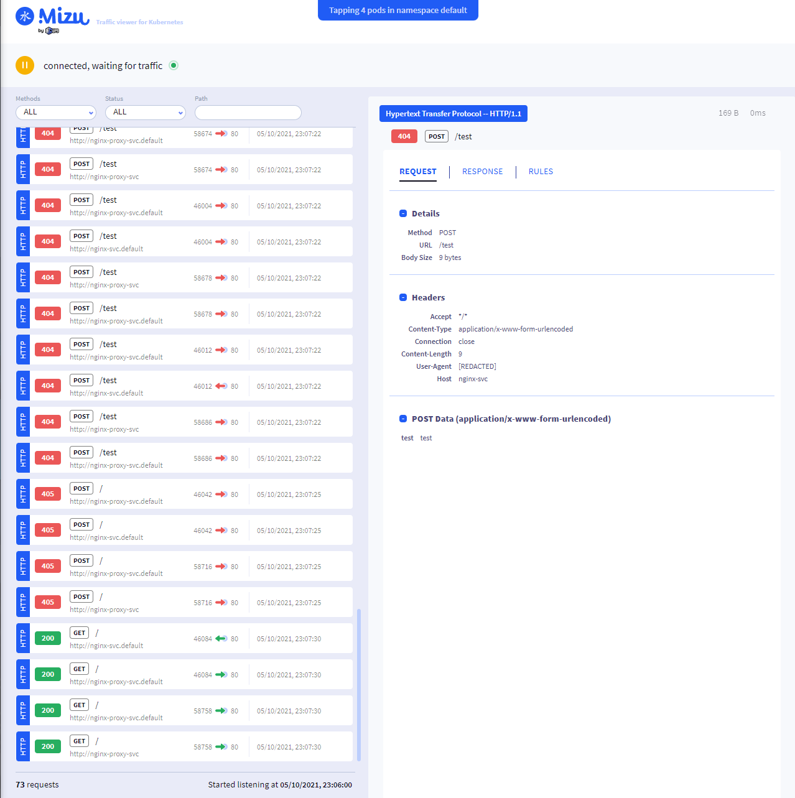

# Note on Mizu

## Basic Feature

- Intercept and display the details of the traffic of a selected list of pod within Kubernetes
- Displayed information includes:
    - Request basic info
    - Request header
    - Request body
    
    - Response basic info
    - Response header
    - Response body
    
- Real-time update of data
- Supported protocol
    - HTTP/REST/gRPC

## Test Detail

### Testbench Setup

### Screenshots

## Note

- Captured data can contain sensitive information
- Tapper is deployed as a daemonset with high permission (privileged container)
- Mizu resources only started as long as CLI is on
- Mizu can upload traffic for analysis
- Mizu can dump log
- Stored traffic size is configurable
- Documentation is incomplete

Reference: [Getmizu](https://getmizu.io/), [GitHub](https://github.com/up9inc/mizu)